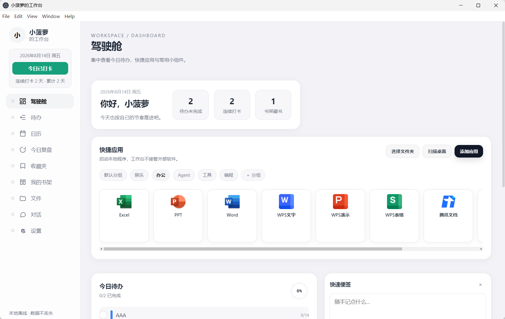
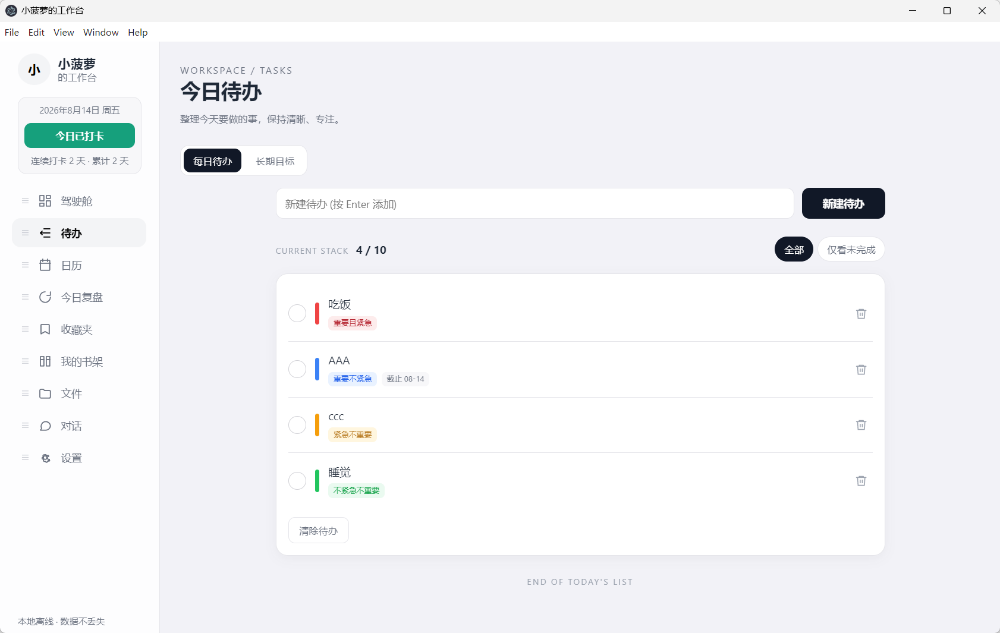
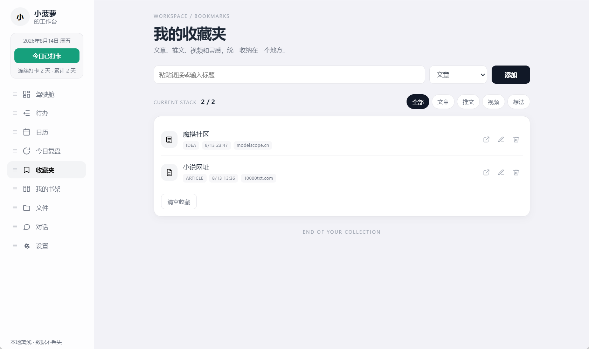
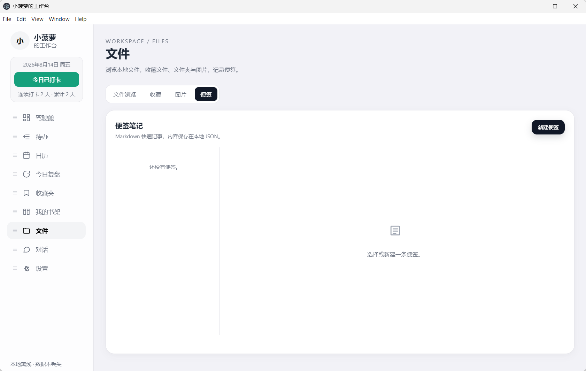
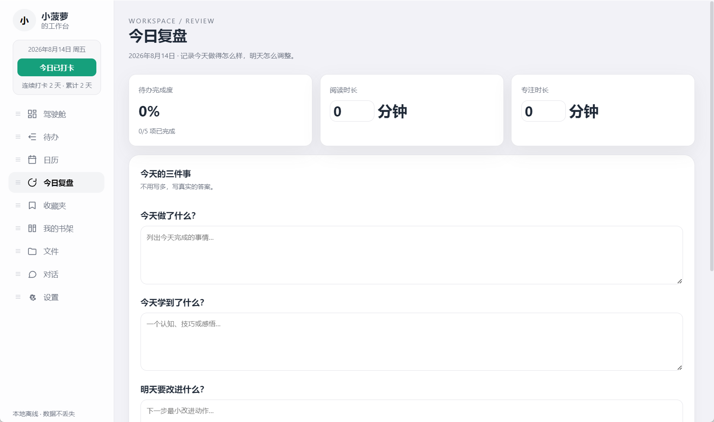
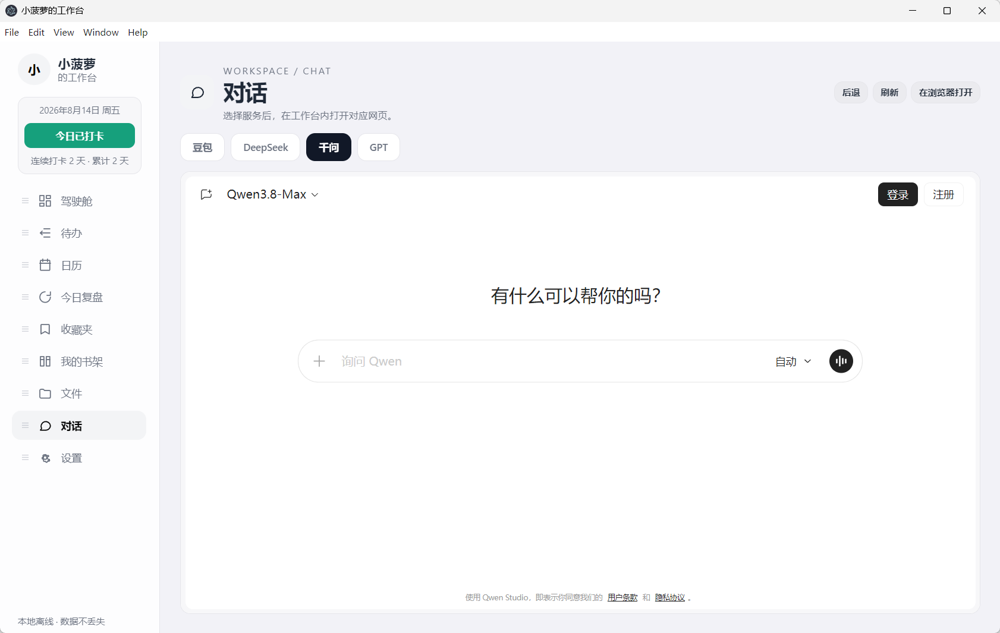
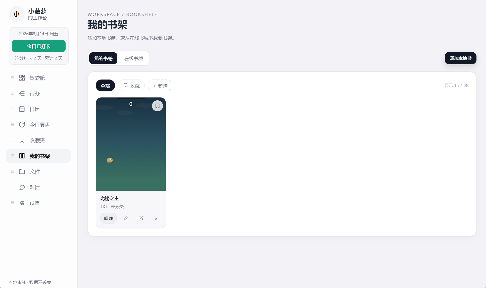
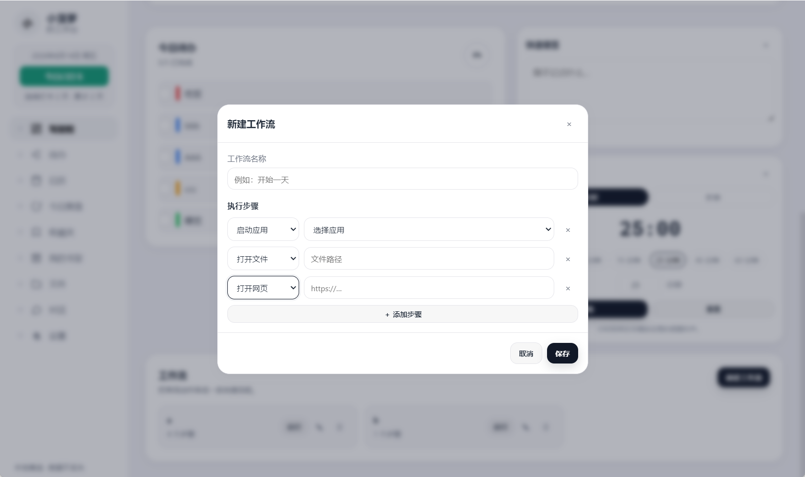

# 四一四工作台

<div align="center">

**一款完全离线的 Windows 本地个人工作台**

[](https://github.com/xxxbl-66/xiaoboluo-workbench/releases)
[](https://www.electronjs.org/)
[](https://vuejs.org/)
[](https://vite.dev/)
[](./package.json)

> 把快捷启动、待办规划、日历、收藏、笔记、阅读和复盘，收进一个安静、克制、离线的桌面空间。

</div>

## 项目简介

四一四工作台是一款面向 Windows 的本地个人工作台桌面应用，基于 Electron + Vue 3 构建。它专注于「个人效率管理」，不依赖后台服务器，不需要登录账号，默认不主动联网。

所有用户数据都以 JSON 文件形式保存在 Windows「文档」目录下的独立文件夹中，与安装目录分离。软件升级或更名后，你的应用列表、待办、笔记和资源引用都不会丢失。

## 核心特点

- **完全离线**：应用本体不主动联网，数据保存在本机。
- **数据自主**：JSON 存储、文档目录独立数据文件夹，方便查看、备份与迁移。
- **一站式效率面板**：驾驶舱聚合今日待办、快捷启动、小组件和打卡签到。
- **原生优先**：未引入重型 UI 框架，交互轻快，界面现代简约。
- **隐私可控**：天气、备份等可选联网能力默认关闭，按需开启。

## 功能总览

| 模块 | 说明 |
| --- | --- |
| 驾驶舱 | 今日待办进度、快捷应用、可自定义小组件、打卡签到 |
| 快捷应用 | 添加本地 exe、自动读取图标、自定义名称与分组、拖拽排序 |
| 待办 | 四象限排序、优先级与紧急程度、截止时间、提醒、未完成筛选 |
| 长期目标 | 设置周期任务，自动同步到待办和日历，打卡推进进度 |
| 日历 | 日程、待办截止日、农历、节气与节日展示 |
| 收藏夹 | 收藏文章、链接、视频、推文或任何想法 |
| 今日复盘 | 回答「今天做了什么 / 学到了什么 / 明天改进什么」，并查看历史记录 |
| 文件 | 文件、图片、文件夹收藏，点击调用系统打开 |
| 图片与便签 | 画廊预览、缩略图缓存、Markdown 便签 |
| 我的书架 | 本地书籍、内置在线书城、章节阅读、字号与配色调整 |
| 对话 | 内置豆包、DeepSeek、千问、GPT 网页入口，在工作台窗口内打开 |
| 工作流 | 编排本地操作流程，保存与运行常用工作流 |
| 设置 | 用户信息、主题、开机自启动、数据目录、备份、铃声与数据管理 |

## 界面预览

<table>
  <tr>
    <td></td>
    <td></td>
    <td></td>
  </tr>
  <tr>
    <td></td>
    <td></td>
    <td></td>
  </tr>
  <tr>
    <td></td>
    <td></td>
    <td></td>
  </tr>
</table>

## 快速开始

### 方式一：直接下载安装

前往 [Releases](https://github.com/xxxbl-66/xiaoboluo-workbench/releases/latest) 下载最新版本：

- **安装包**：[四一四工作台安装版](https://github.com/xxxbl-66/xiaoboluo-workbench/releases/download/v0.1.3/414-Workbench-v0.1.3-Setup-x64.exe)
- **便携版**：[四一四工作台便携版](https://github.com/xxxbl-66/xiaoboluo-workbench/releases/download/v0.1.3/414-Workbench-v0.1.3-Portable-x64.exe)

便携版无需安装，直接运行即可。安装包支持选择安装目录，并会创建桌面和开始菜单快捷方式。

### 方式二：从源码运行

环境要求：

- Windows 10/11
- Node.js 18+（推荐 20+）
- npm

```bash
# 1. 克隆仓库
git clone https://github.com/xxxbl-66/xiaoboluo-workbench.git
cd xiaoboluo-workbench

# 2. 安装依赖
npm install

# 3. 启动开发模式
npm run dev
```

如果 Electron 下载缓慢或失败，可以设置镜像后重新安装：

```powershell
$env:ELECTRON_MIRROR = "https://npmmirror.com/mirrors/electron/"
npm install
```

## 常用命令

| 命令 | 说明 |
| --- | --- |
| `npm install` | 安装项目依赖 |
| `npm run dev` | 启动本地开发环境 |
| `npm run build` | 构建 Vue 渲染层 |
| `npm start` | 使用 Electron 启动已构建的应用 |
| `npm run dist` | 打包 Windows 安装包与便携版 |

打包产物默认输出到 `dist-release/v0.1.3`：

```text
dist-release/v0.1.3/
├─ 四一四工作台_安装版.exe
└─ 四一四工作台_便携版.exe
```

## 项目结构

```text
414-workbench/
├─ electron/                 # Electron 主进程与预加载脚本
│  ├─ main.cjs               # 主进程入口与 IPC 注册
│  ├─ preload.cjs            # 安全隔离的预加载桥接
│  ├─ store.cjs              # JSON 数据存储
│  ├─ defaults.cjs           # 默认配置
│  └─ services/              # 应用、文件、备份、启动等系统服务
├─ src/renderer/             # Vue 3 渲染进程
│  ├─ index.html             # 渲染入口
│  └─ src/
│     ├─ views/              # 页面视图
│     ├─ components/         # 可复用组件
│     ├─ composables/        # 状态与组合式逻辑
│     └─ utils/              # 农历、四象限等工具函数
├─ scripts/                  # 开发启动脚本
├─ build/                    # 应用图标
├─ docs/                     # 文档与界面截图
├─ package.json              # 依赖与 electron-builder 配置
└─ vite.config.mjs           # Vite 构建配置
```

## 数据与隐私

应用数据默认保存在：

```text
C:\Users\<你的用户名>\Documents\小菠萝的工作台
```

> 说明：该目录名是历史版本（原名「小菠萝的工作台」）沿用下来的内部路径，
> 应用更名后**保持不变**，以便老用户升级后能直接读到原有数据。
> 目录名不影响软件对外显示的名称；你也可以在「设置 → 数据目录」中把它迁移到任意位置。

- 所有用户数据使用 JSON 文件存储。
- 文件、图片仅保存原始路径，不复制大文件。
- 图片缩略图会缓存到数据目录，用于画廊预览。
- 应用本体不主动联网；天气、备份等可选联网能力默认关闭。
- 对话与在线书城使用内嵌浏览器打开用户主动访问的网页，由对应网站负责网络连接。

## 安全说明

- 渲染进程与主进程通过 `contextBridge` 和受限的 IPC 通道通信。
- 不在渲染层直接暴露 Node.js 能力，外部程序只通过白名单服务启动。
- 不收集、不上传任何使用数据或遥测信息。

## 常见问题

**安装依赖时报 `Electron failed to install correctly`？**

删除本地 Electron 缓存并重新安装：

```powershell
Remove-Item -Recurse -Force node_modules/electron
$env:ELECTRON_MIRROR = "https://npmmirror.com/mirrors/electron/"
npm install
```

**运行便携版或安装包时 Windows 弹出 SmartScreen 提示？**

当前发布包未进行代码签名，这是正常提示。点击「更多信息」后选择「仍要运行」即可。

**升级版本后数据会丢失吗？**

不会。用户数据与安装目录分离，升级安装时不会被覆盖。软件更名后数据目录仍沿用原路径，因此更名不会导致数据丢失。建议定期在「设置 → 备份」中导出一份备份。

**为什么软件叫「四一四工作台」，数据目录却还是「小菠萝的工作台」？**

数据目录属于内部历史标识。为了不让老用户升级后看到一片空白，更名时只调整了对外的产品名称，数据目录保持原路径兼容。它不影响任何界面显示，你可以在「设置 → 数据目录」中更改它的位置。

## 反馈与贡献

如果你发现了问题或有新的想法，欢迎在 [Issues](https://github.com/xxxbl-66/xiaoboluo-workbench/issues) 中提出。

## 许可证

本项目基于 [MIT](https://opensource.org/licenses/MIT) 许可发布。
