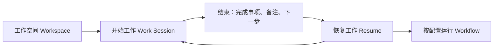
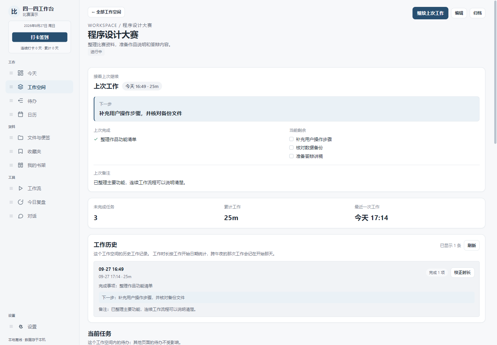
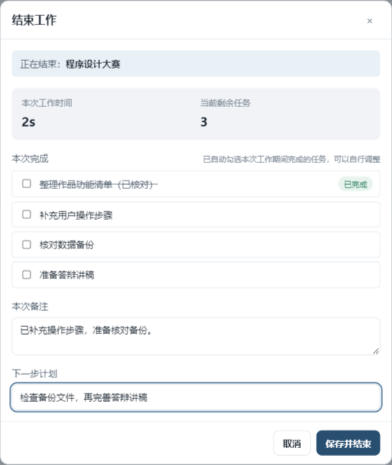
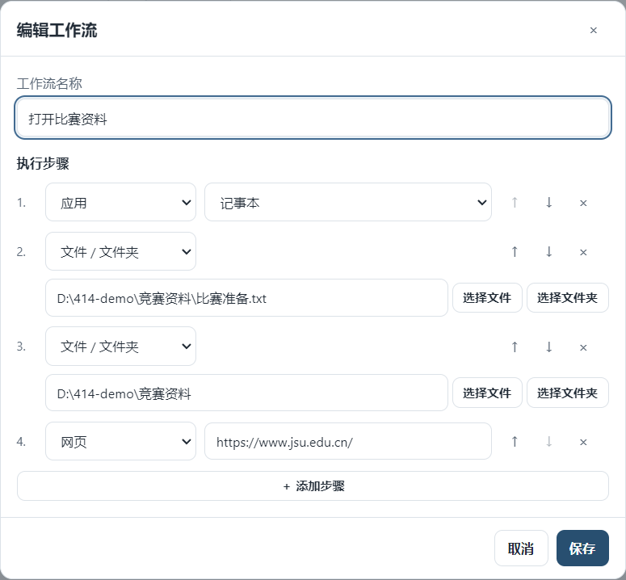

# 四一四工作台

**面向连续工作的 Windows 本地个人工作台。**

[](https://github.com/xxxbl-66/xiaoboluo-workbench/releases/latest)

任务、文件、便签、网页和应用往往分散保存。一次工作被打断后，重新打开软件还不够：还要想起做到哪里、完成了什么，以及下一步先做什么。

四一四工作台用工作空间组织同一个项目的任务与资源，用工作会话记录本次完成事项、备注和下一步。下次回来时，可以查看上次记录、继续工作，并用工作流打开所需资料。核心数据保存在本机，无需账号或业务服务器。

## 下载与运行

当前版本：**v0.2.0**。支持 **Windows 10/11 x64**，运行发布包无需安装 Node.js 或 npm。

| 下载 | 使用方式 |
| --- | --- |
| [安装版：414-Workbench-v0.2.0-setup.exe](https://github.com/xxxbl-66/xiaoboluo-workbench/releases/download/v0.2.0/414-Workbench-v0.2.0-setup.exe) | 按安装向导选择位置，完成后从桌面或开始菜单启动 |
| [便携版：414-Workbench-v0.2.0-portable.exe](https://github.com/xxxbl-66/xiaoboluo-workbench/releases/download/v0.2.0/414-Workbench-v0.2.0-portable.exe) | 双击运行，首次启动需等待运行资源释放 |

也可访问 [全部版本](https://github.com/xxxbl-66/xiaoboluo-workbench/releases)。当前包未配置代码签名，Windows 可能显示未知发布者提示，请先确认下载来源。升级前建议在设置中导出数据备份。

便携版免安装，但数据默认保存在 Windows 文档目录，不会随 EXE 自动移动。

## 连续工作怎么使用

1. 创建工作空间，例如“程序设计大赛”，添加待办、目标和相关资源。
2. 点击“开始工作”，创建一次 Work Session，软件显示本次计时。
3. 处理任务，查看便签，打开文件或网页。需要时运行预设 Workflow。
4. 点击“结束工作”，核对完成事项，填写本次备注和下一步，再保存。
5. 下次从“今天”或原工作空间进入，查看恢复记录并点击“继续上次工作”。配置了默认工作流时，会自动打开相应资源。


```mermaid
flowchart LR
    A[工作空间 Workspace] --> B[开始工作 Work Session]
    B --> C[结束：完成事项、备注、下一步]
    C --> D[恢复工作 Resume]
    D --> B
    D --> E[按配置运行 Workflow]
```

- **Workspace / 工作空间**：同一项目的任务和资源。
- **Work Session / 工作会话**：一次工作记录，同一时间只允许一个进行中的会话。
- **Workflow / 工作流**：按顺序打开应用、文件、文件夹和 HTTP(S) 网页，逐步显示结果；单独运行不会开始计时。
- **Resume / 恢复工作**：展示上次记录与当前任务，继续已结束的工作时创建新会话。

上次完成事项保存结束时的标题快照，任务后续改名或删除不会改写已有快照；当前剩余任务实时读取。恢复的是记录和资源入口，不包括第三方软件的光标、窗口内部状态或内存。

## 界面预览

以下为当前界面的“程序设计大赛”演示数据。

### 工作空间



### 恢复工作


<table>
  <tr>
    <td></td>
    <td></td>
  </tr>
</table>

## 主要功能

| 功能 | 说明 |
| --- | --- |
| 今天 / Dashboard | 当前与最近工作、下一步、今日任务和快速入口 |
| 工作空间 | 名称、描述、任务、长期目标、相关资源、绑定工作流与工作历史 |
| 待办与长期目标 | 具体事项、重要程度和紧急程度、完成状态；期限和周期任务 |
| 便签 | Markdown 编辑与预览，可归属工作空间 |
| 文件与文件夹 | 保存本地路径引用，提供打开和定位入口，不复制原文件 |
| 网页收藏与快捷应用 | 保存 HTTP(S) 链接或本机应用入口，可关联到工作空间 |
| 工作会话与历史 | 起止时间、时长、完成事项快照、备注与下一步 |
| 工作流 | 有序执行资源打开步骤，显示全部成功、部分成功或全部失败 |
| 今日复盘 | 工作统计、用户填写的总结与历史复盘 |
| 日历、书架与图片 | 日程、阅读与图片资料的补充入口 |
| 设置与备份 | 主题、启动设置、数据目录、结构化记录的导出与导入 |

异常关闭后，未结束会话需要由用户选择继续或结束并校正时长。软件无法判断关闭期间是否真的在工作。

## 数据保存与备份

默认数据根目录为 Windows 系统“文档”目录下的：

```text
Documents/小菠萝的工作台/
├─ data/       # 本地 JSON 记录
├─ backups/    # 导出备份与导入前恢复点
└─ config.json # 自定义数据位置配置
```

旧目录名称用于兼容历史数据，软件显示名称为“四一四工作台”。可在“设置 → 数据与备份”查看实际位置、导出备份或更改位置；文档目录被 Windows 重定向时，以软件显示的路径为准。

备份包含结构化记录，不包含所有关联文件、应用程序和第三方网页状态。跨电脑使用时，需要单独保管资料文件并重新确认路径。访问网页、在线服务和 URL 工作流需要网络，本地任务与工作记录不依赖网络。

## 从源码运行

建议使用 **Node.js 22 LTS（22.12 或更新版本）和 npm 10**。当前构建脚本使用 Vite 的原生配置加载方式；依赖版本以 `package-lock.json` 为准。

```powershell
git clone https://github.com/xxxbl-66/xiaoboluo-workbench.git
cd xiaoboluo-workbench
npm ci
npm run dev
```

如需运行已构建的界面：

```powershell
npm run build
npm start
```

### 检查与打包

```powershell
npm test
node scripts/check-refs.cjs
npm run dist -- --x64
```

安装版和便携版输出到：

```text
dist-release/v0.2.0/
├─ 四一四工作台_安装版.exe
└─ 四一四工作台_便携版.exe
```

GitHub Release 使用带版本号的英文附件名，便于下载和引用。首次安装依赖或打包可能需要下载 Electron 和构建工具。

## 系统设计与目录

界面使用 Vue 3，桌面运行与本机操作由 Electron 33 负责，Vite 6 构建渲染层，业务记录通过 JSON DataStore 持久化。


```mermaid
flowchart LR
    A[Renderer / Vue] --> B[Preload API]
    B --> C[Electron Main / IPC]
    C --> D[Services]
    D --> E[本地 JSON DataStore]
```

渲染层通过固定的 Preload 方法请求主进程，不直接暴露 Node.js；主进程校验资源、工作空间归属和数据输入。数据写入使用临时文件替换，并检查版本兼容。备份导入先建立恢复点，出错时尝试恢复原数据。

| 目录 | 内容 |
| --- | --- |
| `electron/` | 主进程、Preload、IPC、数据存储与服务 |
| `src/renderer/` | Vue 页面、组件、状态和样式 |
| `tests/` | 自动化回归用例及辅助程序 |
| `scripts/` | 开发启动和源码引用检查 |
| `build/` | Windows 应用图标 |
| `docs/` | 文档、更新说明与截图 |

## 常见问题

**双击后没有出现新窗口？** 软件采用单实例方式，请检查任务栏或已有窗口，第二次启动会尝试聚焦原窗口。

**文件或应用打不开？** 先检查路径是否存在及访问权限。移动原文件后，需要重新选择路径；网页还需确认 HTTP(S) 地址、网络和默认浏览器。

**升级后如何保留数据？** 用户数据与安装目录分离，保留实际数据目录即可。升级前建议导出备份；恢复结构化记录后，关联资源的原路径仍需有效。

**工作时长包含了休息或离线时间？** 会话按起止时间记录。可以在历史中校正有效时长，并填写原因。

## 更新与反馈

v0.2.0 的变化见 [更新说明](docs/CHANGELOG-v0.2.0.md)。问题与建议可提交到 [Issues](https://github.com/xxxbl-66/xiaoboluo-workbench/issues)。许可证标记见 [package.json](package.json)。
